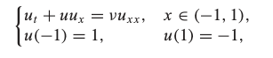
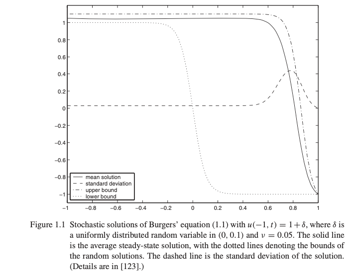

# Numerical Methods for Stochastic Computations

## 介绍 

本章的目的是在不确定性量化（UQ）的背景下介绍随机计算背后的思想。 在不进行广泛讨论（其中有很多讨论）的情况下，我们将使用粘性伯格斯方程的简单示例来说明输入不确定性对物理系统行为的影响以及从仿真开始就需要纳入不确定性 而不是事后的想法。

### 随机建模和不确定量化

研究对象：误差或不确定性对数据（参数值或边界条件）的影响

目的：对实际问题提供更加可靠的预测

必要性：现在的模型在你趋势上确实可以描述一定的定量关系，但是天花板是我们的方程式中各种参数准确分配数值的能力。

优点：不确定性表现为数据的可变性。我们对物理的底层知识可能就是不了解，测量误差本来就普遍存在，从仿真的时候就开始纳入思考的好处就是可以更好的预测之后的物理现象。

#### Burgers'Equation

粘性伯格斯方程：模拟冲击波的传播和反射

U是结果场，v是粘度，这是一个非线性偏微分方程。

Burgers的方程示例表明，对于某些问题，尤其是非线性问题，数据中的较小不确定性可能会导致系统输出的变化不可忽略。如果在计算开始时未考虑不确定性，则无法通过提高经典数值算法的分辨率来捕获此类变化。

这个方程呢，在一维的情况下，u是给定的场v是运动学粘性，这个系统是耗散系统。

## 技术概览

由于数据具有不确定性，主要的方法是将其看作随机变量或随机过程